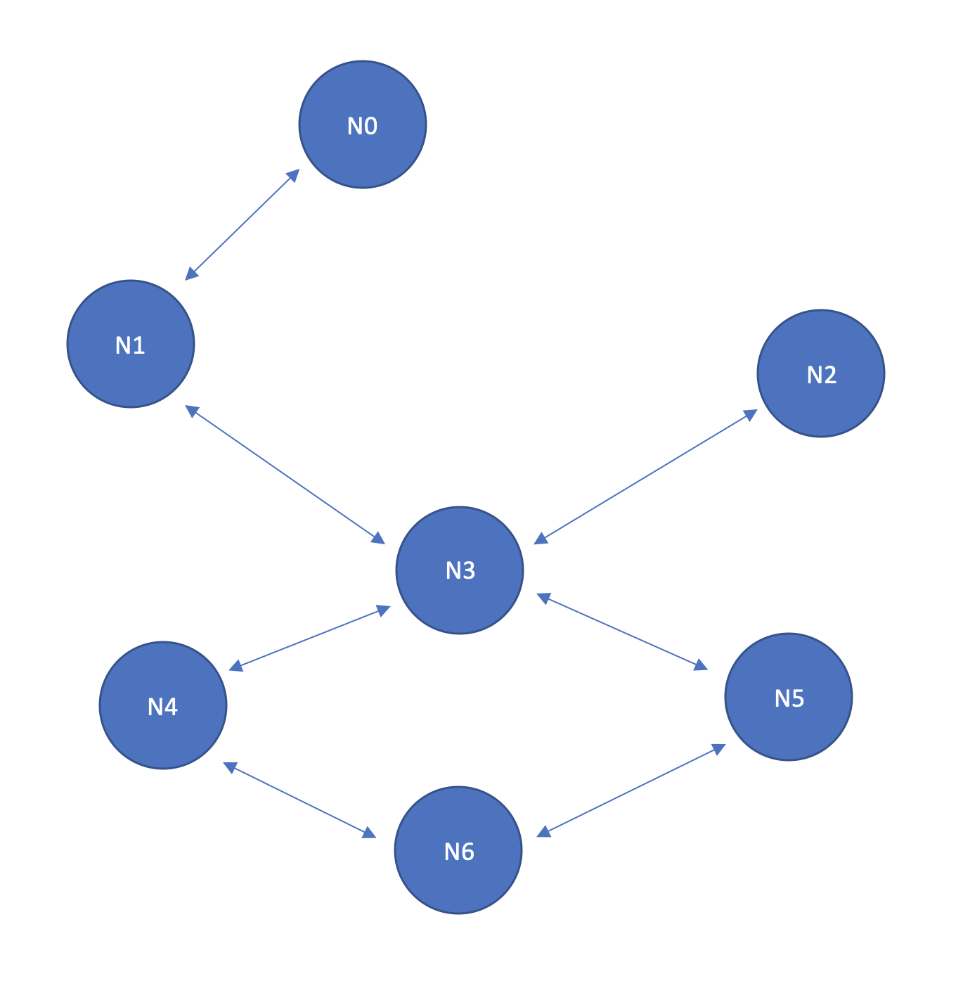

# no-collision-shortest-paths
A declarative _linear programming_ solution that computes the optimal set of non-colliding paths on a graph (optimal: the sum of their lengths is the lowest possible). Written in AMPL.

### The problem:

Let `G` be a graph `(N, E)` where `N` is a given set of nodes and `E` (⊆ N×N) is a set of undirected edges with unitary weigths. Let `G` be inhabited by `n` travellers, such that each traveller `p` is associated with a starting node `s_n(p)` and a end node `e_n(p)`. 

Find, for each traveller `p`, a path from `s_n(p)` to `e_n(p)`. The found paths must have the following properties.

* The `i`-th node in a path cannot be equal to the `i`-th node of another path;
* If a traveller uses an edge from node `i` to node `j` at time `t`, no other traveller can use the same edge from node `j` to `i` at the same time `t` (i.e. two travellers cannot use the same edge at the same time in opposite directions);
* The sum of the lengths of the found paths must be the minimum possible.

### Example



Let's define the graph in a `no_encounter.mod` file and populate the graph of three travellers:

```ampl
# nodes with their names
set NODES := n0, n1, n2, n3, n4, n5, n6;

# undirected edges
set EDGES := 
(n0, n1)
(n1, n3)
(n3, n2)
(n3, n4)
(n3, n5)
(n4, n6)
(n5, n6)
;

# number of travellers
param nTravellers := 3;

# start node of each traveller
param startNodes := 
1 n5 
2 n0
3 n4
;

# end node of each traveller
param endNodes := 
1 n1 
2 n5
3 n6
;

# we assume that no path will be longer than 10 steps.
param maxTicks := 10;
```

Start the `no_encounter.run` file and get the solution:

```
Gurobi 9.0.2: optimal solution; objective 10
15 simplex iterations
At step 1, traveller 1 goes from n5 to n3.
At step 1, traveller 2 goes from n0 to n1.
At step 1, traveller 3 goes from n4 to n6.

At step 2, traveller 1 goes from n3 to n2.
At step 2, traveller 2 goes from n1 to n3.
At step 2, traveller 3 goes from n6 to n4.

At step 3, traveller 1 goes from n2 to n3.
At step 3, traveller 2 goes from n3 to n5.
At step 3, traveller 3 goes from n4 to n6.

At step 4, traveller 1 goes from n3 to n1.
```
